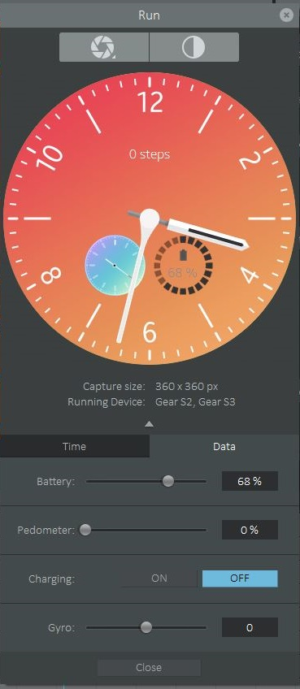

# Gear Watch Designer Sample 
author [@superpikar](http://twitter.com/superpikar)

Sample project of Gear Watch Designer. All the assets used in this project are taken from Gear Watch Designer application itself.

## Preparation
- Install latest JRE from [https://www.java.com/en/download/manual.jsp](https://www.java.com/en/download/manual.jsp).
- Install Gear Watch Designer [http://developer.samsung.com/gear/design/watch-designer](http://developer.samsung.com/gear/design/watch-designer)
- If your PC is 64bit then probably you will get an error message “please install latest JRE (32bit)” when installing Gar Watch Designer. If it's happen, you need to uninstall your current JRE and install JRE 32bit version. After installation is finished try to reinstall Gear Watch Designer.

## How to Run
1. Open Gear Watch Designer application
2. Open project file `tutorial-watch.gwd`
3. Click play icon to running

## Screenshots

